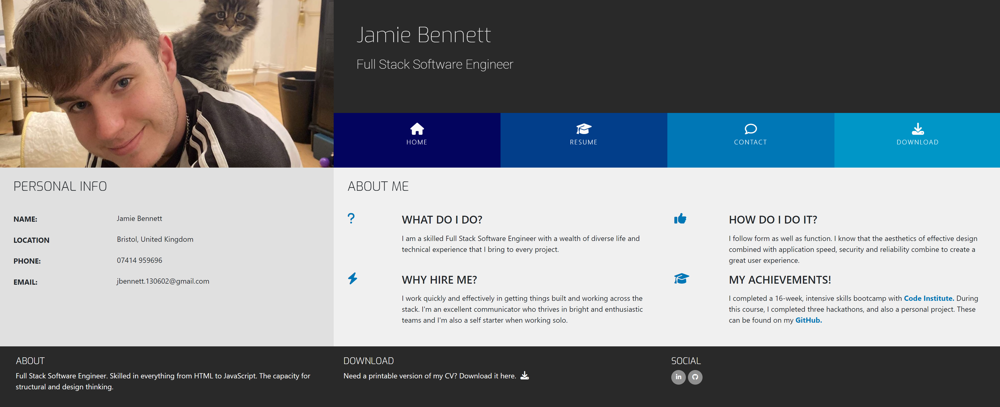
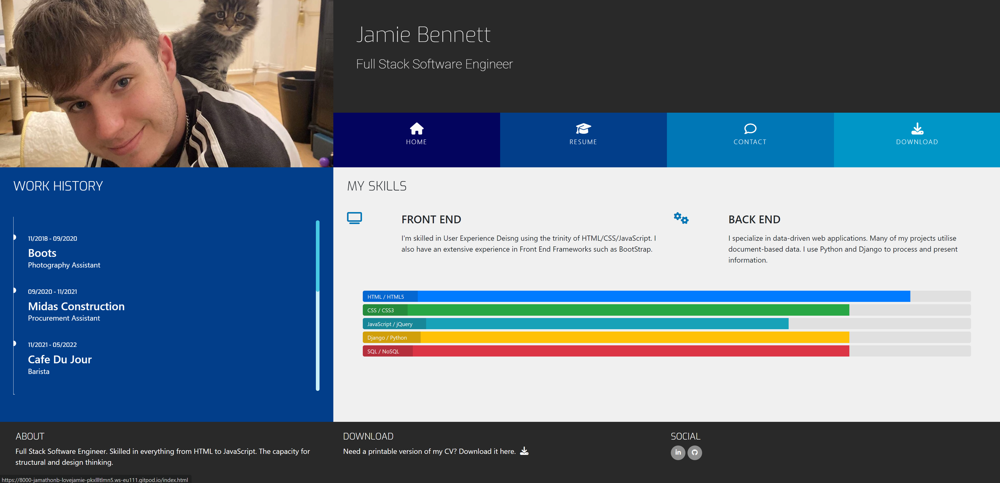
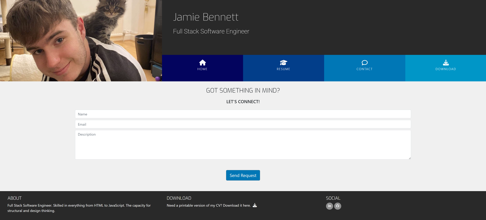

# Love Jamie Project - (Old CV)

## A fully responsive portfolio for my new career in Software Engineering.

This is a project to test my knowledge on HTML, CSS and Bootstrap 5. It is part of the Code Institute course curriculum.

## The Home Page 👇

## The Resume Page 👇

## The Contact Page 👇

